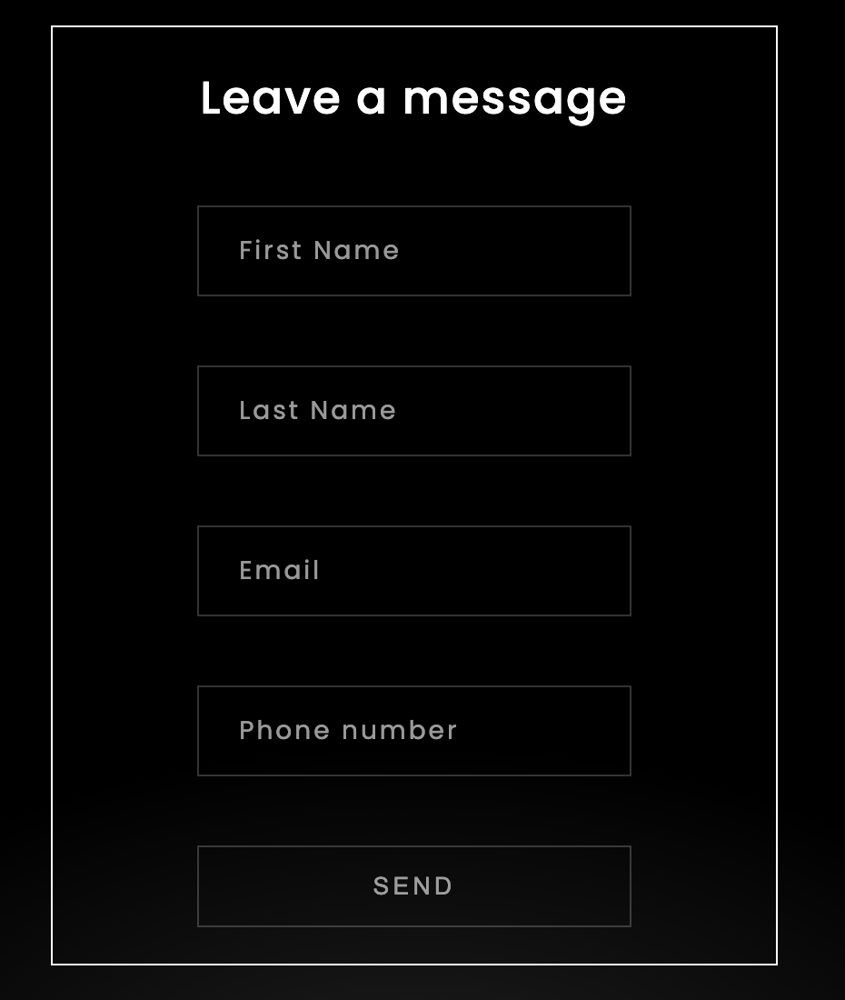
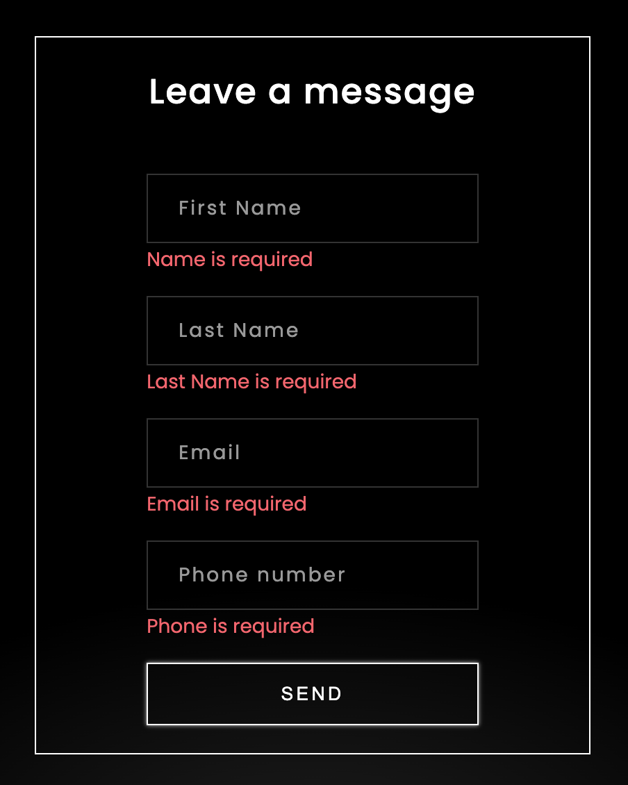
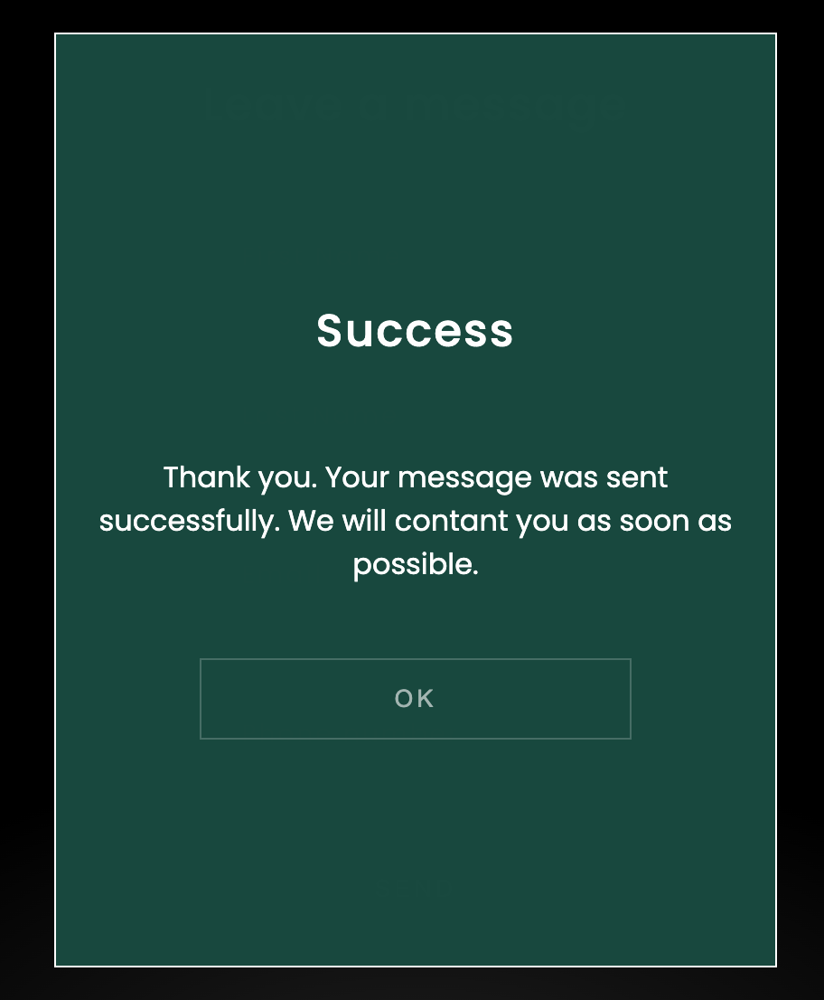

# Contact Form (with validation) - React

## Table of Contents
1. [About](#about)
2. [Technologies](#technologies)
3. [Links](#links)
4. [Preview](#preview)
5. [Contact](#feel-free-to-contact-me)

## About 
I found a little time just for me so I decided to create a contact form with validation of data and modal "success". I added some animation to the modal, please check this out. Below you can find a link. :)

## Technologies:
* React.js
* HTML5
* CSS3
* STYLED COMPONENTS

## Links
* Live Site URL: [E.Kopacz-ToogleTheme](https://toogletheme-ekopacz.netlify.app)

### Preview
Contact Form

Contact Form validation of data

Contact Form succes modal

### Feel free to contact me:
* [Linkedin](https://www.linkedin.com/in/ewelina-kopacz-929559100/)

